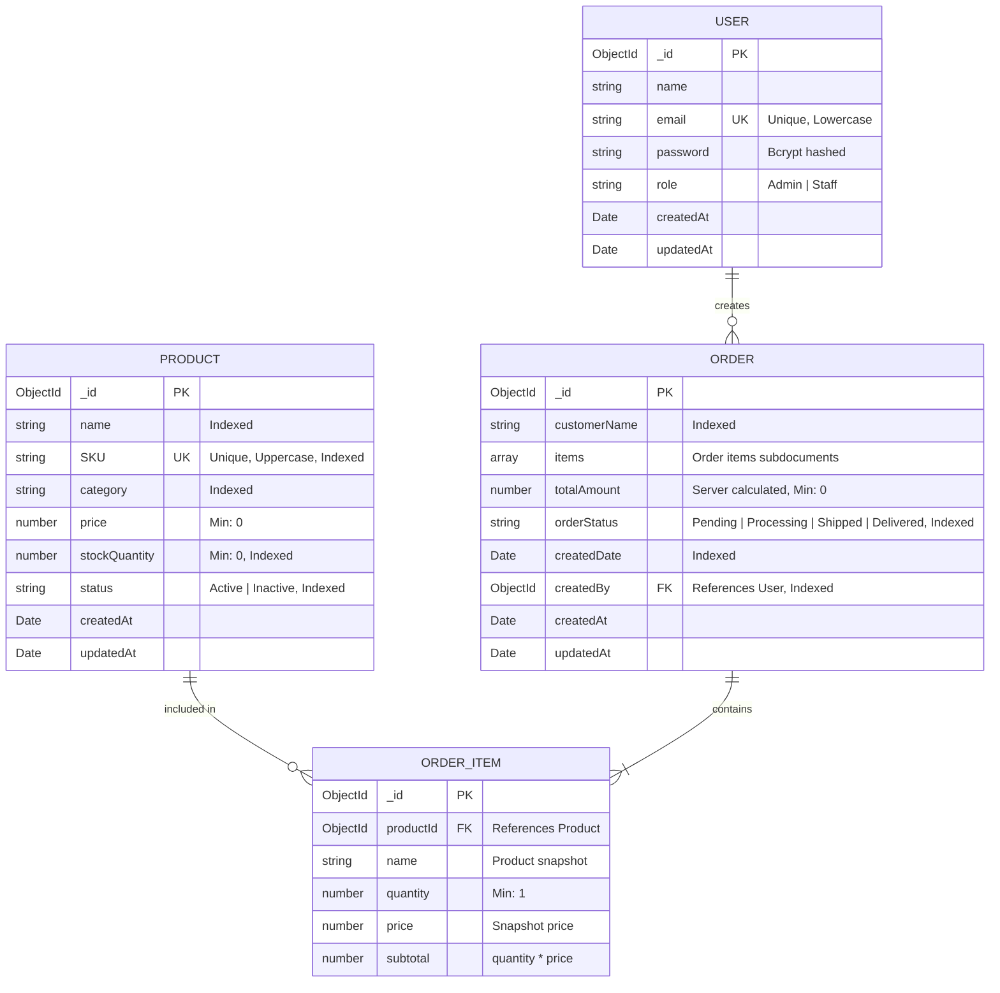

# StockFlow — Database Models Documentation

This document describes the MongoDB database schemas, relationships, constraints, indexes, and business rules implemented using Mongoose.

---

## Entity Relationship Overview

---

## 1. User Model (`backend/models/User.js`)

Manages user identity, credentials, and role-based access levels.

### Schema Fields

| Field | Type | Required | Unique | Default | Description |
|---|---|---|---|---|---|
| `_id` | `ObjectId` | Auto | Yes | Generated | Unique user ID. |
| `name` | `String` | Yes | No | — | User's full name (max 100 chars, trimmed). |
| `email` | `String` | Yes | Yes | — | Unique email address (lowercase, trimmed, regex validated). |
| `password` | `String` | Yes | No | — | Bcrypt hashed password (salt rounds: 12, min 6 characters). |
| `role` | `String` | Yes | No | `'Staff'` | Role enum: `'Admin'` or `'Staff'`. |
| `createdAt` | `Date` | Auto | No | `Date.now` | Account creation timestamp. |
| `updatedAt` | `Date` | Auto | No | `Date.now` | Last update timestamp. |

### Business Rules & Hooks
- **Password Hashing**: Pre-save hook uses `bcrypt.genSalt(12)` to hash the password whenever modified.
- **Credential Comparison**: Instance method `comparePassword(candidatePassword)` securely verifies passwords.
- **Data Protection**: `toJSON` transform automatically strips `password` from API responses.

---

## 2. Product Model (`backend/models/Product.js`)

Manages inventory catalog items, unit pricing, real-time stock levels, and active status.

### Schema Fields

| Field | Type | Required | Unique | Default | Description |
|---|---|---|---|---|---|
| `_id` | `ObjectId` | Auto | Yes | Generated | Unique product ID. |
| `name` | `String` | Yes | No | — | Product name (max 200 chars, trimmed). |
| `SKU` | `String` | Yes | Yes | — | Stock Keeping Unit (unique, uppercase, alphanumeric/hyphens). |
| `category` | `String` | Yes | No | — | Category name (e.g., Electronics, Furniture, Office Supplies). |
| `price` | `Number` | Yes | No | — | Unit price in USD (must be `>= 0`). |
| `stockQuantity` | `Number` | Yes | No | `0` | Available stock count (must be an integer `>= 0`). |
| `status` | `String` | Yes | No | `'Active'` | Status enum: `'Active'` (available for orders) or `'Inactive'`. |
| `createdAt` | `Date` | Auto | No | `Date.now` | Product created timestamp. |
| `updatedAt` | `Date` | Auto | No | `Date.now` | Product last modified timestamp. |

### Indexes
- `{ SKU: 1 }` (Unique): Enforces SKU uniqueness and accelerates lookups.
- `{ name: 'text', SKU: 'text' }`: Accelerates text searches across names and SKUs.
- `{ category: 1 }`: Optimizes category filter queries.
- `{ status: 1 }`: Speeds up active/inactive filtering.
- `{ stockQuantity: 1 }`: Optimizes low-stock threshold calculations (`stockQuantity < 10`).

### Business Rules
- Only **Admin** users can create, update, or delete products.
- Products cannot be deleted if active orders (`Pending` or `Processing`) reference them.
- Inactive products cannot be selected or ordered.

---

## 3. Order Model (`backend/models/Order.js`)

Records customer purchase orders, line items, timestamps, fulfillment status, and the staff member who initiated the order.

### Schema Fields

| Field | Type | Required | Unique | Default | Description |
|---|---|---|---|---|---|
| `_id` | `ObjectId` | Auto | Yes | Generated | Unique order ID. |
| `customerName` | `String` | Yes | No | — | Name of customer or organization placing the order. |
| `items` | `[OrderItem]` | Yes | No | `[]` | Non-empty array of purchased item subdocuments. |
| `totalAmount` | `Number` | Yes | No | — | Total order cost in USD (strictly computed server-side). |
| `orderStatus` | `String` | Yes | No | `'Pending'` | Status enum: `'Pending'`, `'Processing'`, `'Shipped'`, `'Delivered'`. |
| `createdDate` | `Date` | Yes | No | `Date.now` | Timestamp of when the order was placed. |
| `createdBy` | `ObjectId` | Yes | No | — | Reference to `User` model who placed the order. |
| `createdAt` | `Date` | Auto | No | `Date.now` | Creation timestamp. |
| `updatedAt` | `Date` | Auto | No | `Date.now` | Last update timestamp. |

### OrderItem Subdocument Schema

| Field | Type | Required | Description |
|---|---|---|---|
| `_id` | `ObjectId` | Auto | Unique line item ID. |
| `productId` | `ObjectId` | Yes | Reference to `Product` model. |
| `name` | `String` | Yes | Cached product name at the time of order placement. |
| `quantity` | `Number` | Yes | Quantity ordered (integer `>= 1`). |
| `price` | `Number` | Yes | Snapshot price per unit from database at order time. |
| `subtotal` | `Number` | Yes | Line item subtotal (`quantity * price`). |

### Indexes
- `{ orderStatus: 1 }`: Accelerates status filtering (e.g. pending orders count).
- `{ createdBy: 1 }`: Enforces role-based query isolation for staff accounts.
- `{ createdDate: -1 }`: Optimizes reverse-chronological sorting and date range queries.
- `{ customerName: 1 }`: Accelerates search by customer name.

### Business Rules
- **Server Calculation**: Client-supplied `totalAmount` or `subtotal` is completely ignored and strictly recalculated from current product prices.
- **Stock Validation**: Validates that each item is `'Active'` and that `product.stockQuantity >= requestedQuantity`.
- **Atomic Decrement**: Atomically reduces product stock using `$inc: { stockQuantity: -quantity }`.
- **Concurrency Safeguard**: If stock runs out during checkout, decrements are rolled back and a `400`/`409` error is returned.
- **Role Isolation**:
  - Staff accounts can only view orders where `createdBy == user._id`.
  - Admin accounts can view all orders across the business.
  - Only Admin accounts can update `orderStatus`.
